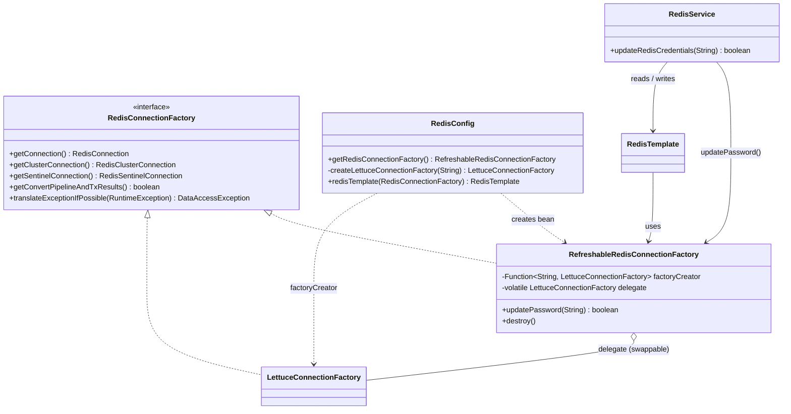
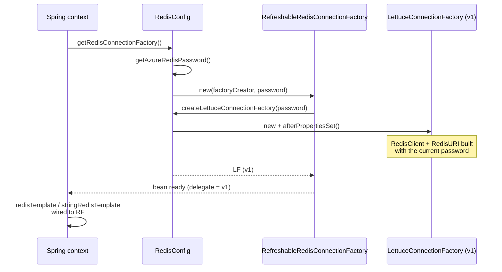
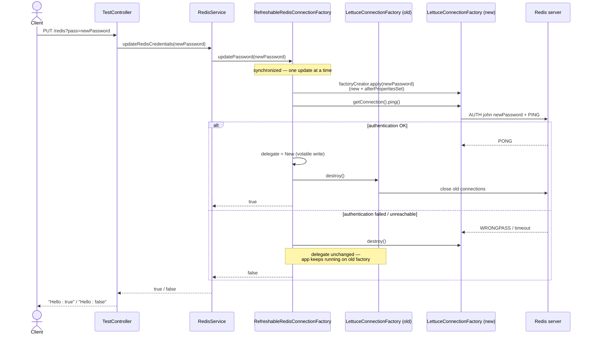
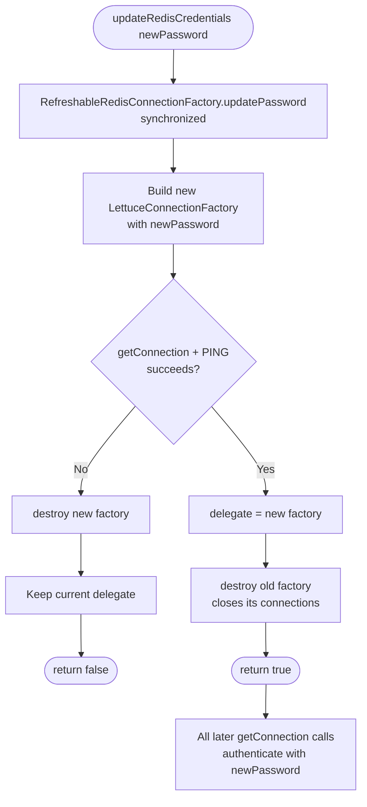
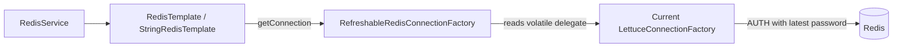

# Redis Credential Update — Technical Document

## 1. Purpose

Change the Redis password **at runtime, without restarting the application**, so that every Redis connection created
afterwards authenticates with the new password.

Entry point: `RedisService.updateRedisCredentials(String password)`, exposed through `PUT /redis?pass=<newPassword>`
in `TestController`.

## 2. Background — why `setPassword()` was not enough

The earlier version called the deprecated `LettuceConnectionFactory.setPassword(password)`. In Spring Data Redis 2.7.7
(Spring Boot 2.7.8, Lettuce 6.1.10) this has no effect on connections:

| Step | What happens inside `LettuceConnectionFactory` |
|---|---|
| `afterPropertiesSet()` | Builds a `RedisClient` with a `RedisURI`. The username and password are **copied into the URI once**. |
| `setPassword()` | Updates only `RedisStandaloneConfiguration`. The `RedisClient` / `RedisURI` built earlier still has the **old** password. |
| Shared native connection | Already logged in with the old password; it stays in use. |
| `destroy()` | Sets `destroyed = true`. The factory **cannot be started again** (`assertInitialized()` fails). |

Result: after a server-side password rotation, any new or reconnecting connection fails with
`WRONGPASS invalid username-password pair or user is disabled`. This was reproduced (see §7, check A).

## 3. Solution overview

Instead of changing an already-started factory, **build a new `LettuceConnectionFactory` with the new password and
swap it in** behind a stable wrapper bean.

- `RefreshableRedisConnectionFactory` implements `RedisConnectionFactory` and is the **only** connection-factory bean.
- It passes every call through to a `volatile LettuceConnectionFactory delegate`.
- `RedisTemplate` / `StringRedisTemplate` keep a reference to the wrapper, never to the delegate, so they pick up the
  new factory automatically — they ask for a connection on every operation.

## 4. Components

| File | Role |
|---|---|
| `config/RefreshableRedisConnectionFactory.java` | Wrapper; holds the current delegate; `updatePassword()` builds, checks and swaps; shuts the delegate down on app shutdown (`DisposableBean`). |
| `config/RedisConfig.java` | `getRedisConnectionFactory()` bean returns the wrapper. `createLettuceConnectionFactory(String password)` holds the host / port / username / timeout settings and is used for both the first factory and every replacement. `redisTemplate` bean now takes `RedisConnectionFactory`. |
| `service/RedisService.java` | `updateRedisCredentials(password)` → `connectionFactory.updatePassword(password)`. |
| `controller/TestController.java` | `PUT /redis?pass=...` → returns `Hello : true/false`. |

### Class diagram

## 5. Flow diagrams

### 5.1 Application startup

### 5.2 Password update — sequence

### 5.3 Password update — decision flow

### 5.4 Normal Redis call after the update

## 6. Behaviour summary

| Scenario | Result |
|---|---|
| Correct new password | Returns `true`; all new connections and reconnects use it. |
| Wrong password / Redis unreachable | Returns `false`; the new factory is thrown away; the app keeps working on the current password. |
| Two updates at the same time | Run one after the other (`synchronized`). |
| Redis drops connections after the update | Lettuce reconnects using the **new** password. |
| Application shutdown | Wrapper `destroy()` shuts down the current delegate. |

**Order of operations for a rotation:** change the password on the Redis server (or add the new one alongside the old,
for example `ACL SETUSER john >newPassword`), **then** call `updateRedisCredentials(newPassword)`. The update checks the
new password against the server, so calling it before the server knows the new password returns `false`.

## 7. Verification

Tested against a throwaway Redis (ACL user `john`) with the compiled `RefreshableRedisConnectionFactory` and the same
client settings as `RedisConfig`. The server password was rotated before each update.

| # | Check | Result |
|---|---|---|
| A | Old `setPassword()` + fresh connection | Fails with `WRONGPASS` → original bug confirmed |
| B1 | Works with starting password | Pass |
| B2 | Wrong password → `false` (~138 ms) | Pass |
| B3 | After rejected update, app still works | Pass |
| B4–B5 | Correct password → `true`, read/write works | Pass |
| B6 | Server drops all connections → reconnect uses new password | Pass |
| B7 | Old password no longer valid on server | Pass |
| C1–C2 | Swap while 8 threads send commands nonstop | Pass — **2 of ~6,166 commands failed** with `Connection closed` during the swap |

Not tested: full application startup (needs the database). Bean wiring was checked by reading the code.

## 8. Known limitations and follow-ups

1. **Commands in flight during the swap can fail.** The old factory is shut down right away, so a command already
   running on it gets `Connection closed` (seen in check C). Fix: shut the old factory down after a short grace period
   (for example, schedule `oldFactory.destroy()` a few seconds later).
2. **Small race on `getConnection()`.** A thread that read the old delegate just before the swap can call
   `getConnection()` on it after it is shut down and get `IllegalStateException: ... was destroyed`. The grace period
   in item 1 also covers this.
3. **A failed update can block for up to the connect timeout** (5 s) while holding the lock, because of the check.
4. **Password in the URL.** `PUT /redis?pass=...` can leak the password into access logs and proxy logs. Move it to the
   request body and protect the endpoint.
5. **Standalone Redis only.** `createLettuceConnectionFactory` builds a `RedisStandaloneConfiguration`; Sentinel or
   Cluster setups need their own configuration in that method. The wrapper itself works the same way.
6. **Reactive API not exposed.** The wrapper implements only `RedisConnectionFactory`, not
   `ReactiveRedisConnectionFactory`, so Spring Boot's reactive Redis template is not created.
